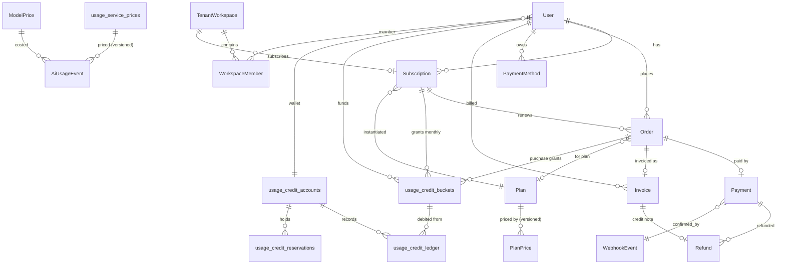
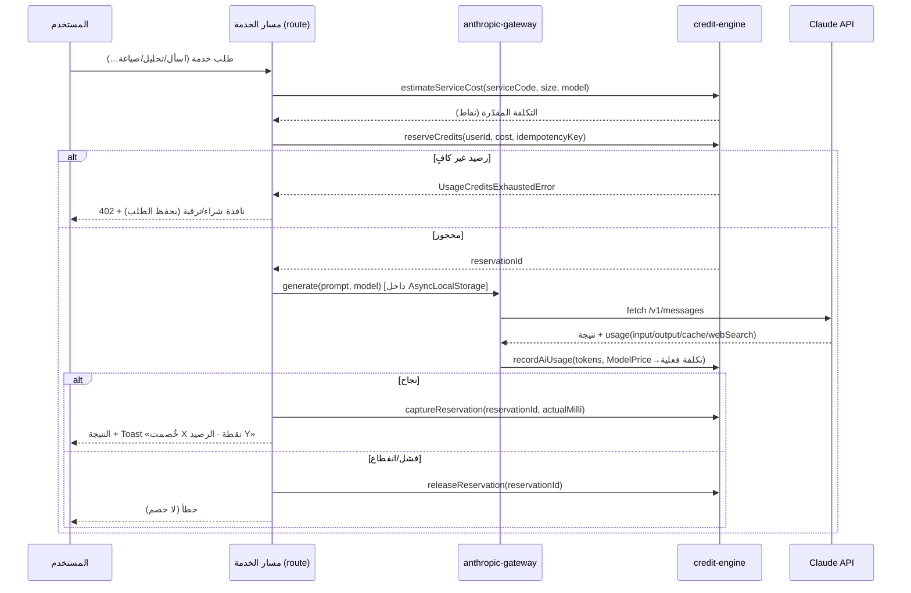
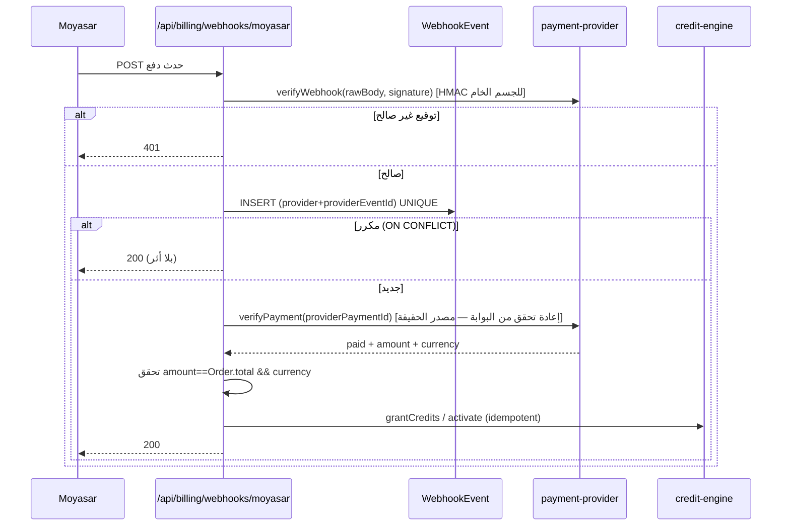
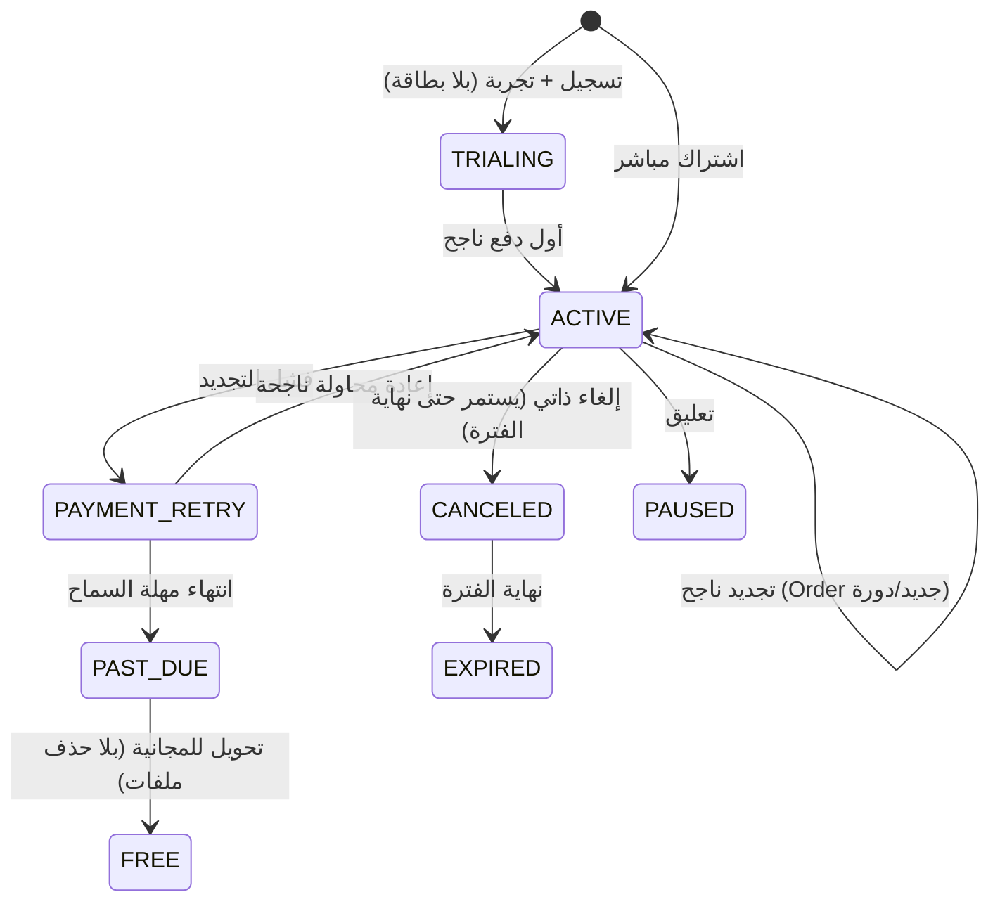
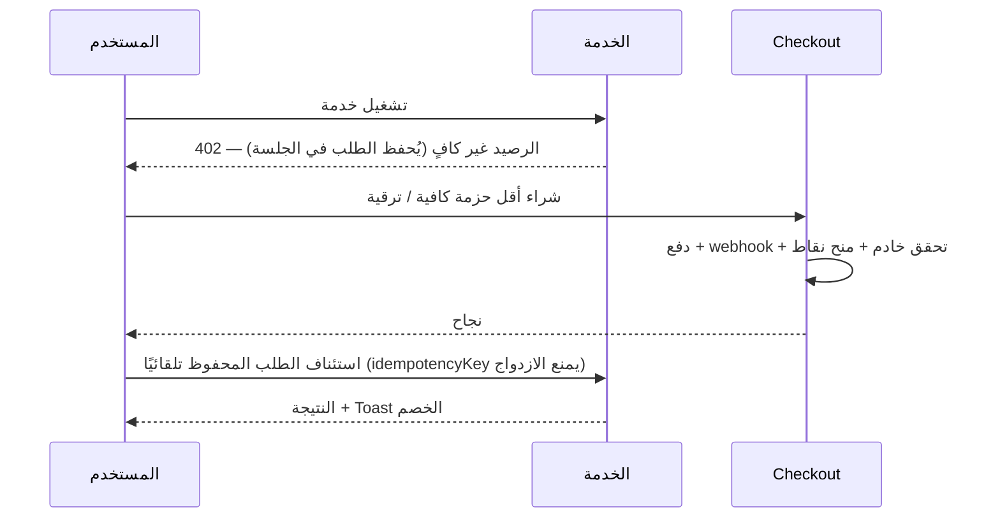

# مخطط نظام النقاط والاشتراكات والمدفوعات

**المرجع:** HKM-BILLING-UX-001 · المخرج رقم 2 (مخطط النظام)
**التاريخ:** 2026-08-02 · **الفرع:** `claude/hakim-billing-system-rato3i`
**يعتمد على:** [`billing-baseline-audit.md`](./billing-baseline-audit.md)
**الحالة:** تصميم للاعتماد قبل كتابة الكود.

---

## 0. القرارات الحاكمة (مُعتمدة)

| القرار | الاختيار |
|---|---|
| **مصطلح النقاط** | «النقطة» واجهة عرض فوق محرك «وحدات الاستخدام v2» القائم. **1 نقطة = 1000 milli-unit**. نطوّر v2 ونفعّله، لا نبني دفترًا موازيًا. |
| **الأسعار/الخطط** | تُبذر بقيم الأمر التنفيذي بالضبط (FREE/INDIVIDUAL 49/PROFESSIONAL 149/OFFICE 499/ENTERPRISE؛ نقاط 500/2200/9000؛ حزم 250@29·700@69·1600@139)، قابلة للتعديل من الإدارة بإصدارات مؤرّخة. |
| **النماذج المالية الجديدة** | Prisma models كاملة (type-safe + migration). محرك الرصيد يبقى بجداول v2 الخام (نمط المشروع المتعمّد)، مع **إضافة طبقة Buckets**. |
| **المال** | بالهللات كأعداد صحيحة دائمًا. لا أرقام عشرية. |
| **التفعيل** | كل شيء خلف أعلام؛ لا تفعيل إنتاجي قبل المراحل A→E والاختبارات والتقرير النهائي. |

### مبدأ التوحيد (النقطة ↔ milli-unit)
```
1 نقطة (point)            = 1000 milli-units
سعر الخدمة بالنقاط        = milliUnits / 1000   (عرض للمستخدم)
milliUnits المخزّنة        = points × 1000       (تخزين داخلي)
```
دوال التحويل في `lib/modules/credits/points.ts`: `pointsToMilli(p)` و`milliToPoints(m)`.
كل الواجهات تعرض «نقاط»؛ كل التخزين/المحرك بالـ`milli-units` (يحفظ الأرصدة والأسعار المبذورة سلفًا).

---

## 1. المعمارية ثلاثية الطبقات (§3 من الأمر)

```
┌─────────────────────────────────────────────────────────────┐
│ 1) Entitlements  — ماذا تسمح الباقة؟  (Plan.entitlements JSON)│
│    الخدمات المتاحة · المقاعد · حدود الملفات · التصدير ·        │
│    النموذج المسموح · الأولوية                                  │
├─────────────────────────────────────────────────────────────┤
│ 2) Credits       — كم يملك المستخدم؟ (محرك v2 + Buckets)       │
│    reserve → capture / release · نفاد الأقرب انتهاءً أولًا      │
├─────────────────────────────────────────────────────────────┤
│ 3) Provider Cost — كم كلّفنا فعليًا؟ (AiUsageEvent + ModelPrice)│
│    تكلفة Claude/البحث/التخزين · داخلي للربحية · لا يُعرض للعميل  │
└─────────────────────────────────────────────────────────────┘
```
الطبقات مستقلة: قد تسمح الباقة بخدمة (Entitlement) لكن يمنعها نقص الرصيد (Credits)؛
والتكلفة الفعلية (Provider Cost) لا تؤثر على ما يُخصم من المستخدم (سعر منشور ثابت لكل طلب).

---

## 2. نموذج البيانات

### 2.1 يُعاد استخدامه كما هو (جداول v2 الخام — لا حذف/إعادة تسمية)
`usage_credit_accounts` · `usage_credit_ledger` · `usage_credit_reservations` ·
`usage_service_prices` · `usage_credit_packages` · `usage_credit_quotas` ·
`credit_transactions` (نقاط الولاء) · `billing_events`.

### 2.2 يُطوَّر (إضافات آمنة `IF NOT EXISTS`)
- **جدول جديد `usage_credit_buckets`** — يحقّق مفهوم «المصدر المستقل» + الأولوية + الانتهاء (§4 CreditBucket، §5 نفاد الأقرب انتهاءً). المحفظة `usage_credit_accounts` تبقى ملخّصًا ذريًا (§18)، والـBuckets مصدر التفصيل.
  ```
  usage_credit_buckets(
    id, userId, sourceType, sourceReferenceId,
    grantedMilliUnits, remainingMilliUnits,
    startsAt, expiresAt NULL, priority, createdAt
  )
  sourceType ∈ TRIAL|SUBSCRIPTION|PURCHASE|PROMOTION|REFUND|ADMIN_GRANT|LEGACY_MIGRATION
  INDEX (userId, status, expiresAt)   -- لاختيار الأقرب انتهاءً
  ```
- **`usage_service_prices`**: تُحدَّث القيم المبذورة إلى نقاط الأمر التنفيذي × 1000، وتُضاف أعمدة `version`, `effectiveFrom`, `effectiveTo`, `displayNameAr/En` لحفظ إصدار السعر مع كل طلب (§3).
- **`usage_credit_ledger`**: يُضاف `bucketId`, `serviceCode`, `requestId`, `actorUserId` (اختيارية، `IF NOT EXISTS`) لمطابقة `CreditLedgerEntry`.

### 2.3 نماذج Prisma جديدة (الطبقة المالية — §4)
كلها `@@map` بأسماء snake_case، ومبالغ بالهللات (`Int`/`BigInt`).

| النموذج | الغرض | ملاحظات مفتاحية |
|---|---|---|
| `Plan` | كتالوج الباقات | `code, nameAr/En, monthlyPoints, includedSeats, entitlements Json, isActive, sortOrder` |
| `PlanPrice` | أسعار مؤرّخة لكل باقة | `billingPeriod, subtotalHalalas, vatHalalas, totalHalalas, effectiveFrom/To, isActive` |
| `Subscription` | اشتراك المستخدم/المساحة | حالات `TRIALING|ACTIVE|PAST_DUE|PAYMENT_RETRY|CANCELED|EXPIRED|PAUSED` |
| `Order` | طلب شراء (اشتراك/حزمة) | `type, status, *Halalas, planId?, pointsPackageCode?, idempotencyKey UNIQUE` |
| `Payment` | محاولة/نتيجة دفع | `provider, providerPaymentId, status, amountHalalas, providerFeeHalalas, failure*` |
| `PaymentMethod` | وسيلة مرمّزة | `providerToken (مشفّر), brand, lastFour, expiry*, isDefault` — **لا PAN/CVC** |
| `Invoice` | فاتورة ضريبية | `invoiceNumber متسلسل, vatRateBps, *Halalas, seller/buyerSnapshot Json, zatcaStatus, pdfUrl?, xmlUrl?` |
| `Refund` | استرداد | `paymentId, amountHalalas, pointsReversed, status` |
| `WebhookEvent` | أحداث البوابة | `provider+providerEventId UNIQUE, signatureVerified, payload Json, status, attempts` |
| `BillingAuditLog` | تدقيق مالي | كل تعديل سعر/منح/سحب/اشتراك/استرداد/إعادة webhook |
| `ModelPrice` | أسعار Claude المؤرّخة | `provider, model, input/output/cacheWrite/cacheRead UsdPerMillion, webSearchUsdPerRequest, effectiveFrom/To` |
| `TenantWorkspace` + `WorkspaceMember` | مقاعد OFFICE/ENTERPRISE | `workspaceId` على `Subscription`/`CreditBucket`؛ رصيد مشترك |

> `AiUsageEvent` و`ServiceRate` و`CreditBucket/Ledger/Reservation` من §4: **تُنفَّذ فوق جداول v2 الخام**
> (لا نكرّرها كنماذج Prisma) حفاظًا على «لا نظام موازٍ». الطبقة المالية أعلاه هي الجديد الحقيقي.

### 2.4 مخطط الكيانات (ERD)



### 2.5 مطابقة مفاهيم الأمر التنفيذي بالتنفيذ

| §4 في الأمر | التنفيذ | نوع |
|---|---|---|
| CreditBucket | `usage_credit_buckets` (جديد) | جدول خام |
| CreditLedgerEntry | `usage_credit_ledger` (قائم، موسّع) | جدول خام |
| CreditReservation | `usage_credit_reservations` (قائم) | جدول خام |
| ServiceRate | `usage_service_prices` (قائم، موسّع بالإصدار) | جدول خام |
| AiUsageEvent | `ai_usage_events` (قائم، موسّع بالتكلفة) | جدول خام |
| Plan/PlanPrice/Subscription/Order/Payment/PaymentMethod/Invoice/Refund/WebhookEvent/BillingAuditLog/ModelPrice | نماذج Prisma جديدة | Prisma |

---

## 3. بيانات البذر (Seed) — من الأمر التنفيذي

### الباقات (`Plan` + `PlanPrice`، الأسعار شاملة الضريبة 15% = 1500 bps)
| code | نقاط/شهر | مقاعد | السعر الإجمالي (شامل) | subtotal | vat |
|---|---|---|---|---|---|
| FREE | 100 (تجريبية) | 1 | 0 | 0 | 0 |
| INDIVIDUAL | 500 | 1 | 49.00 (4900 هللة) | 4261 | 639 |
| PROFESSIONAL | 2,200 | 1 | 149.00 (14900) | 12957 | 1943 |
| OFFICE | 9,000 (مشتركة) | 5 | 499.00 (49900) | 43391 | 6509 |
| ENTERPRISE | تفاوضي | تفاوضي | عرض سعر | — | — |

> الحساب: `subtotal = round(total / 1.15)`, `vat = total − subtotal` (بالهللات). القيم أعلاه للتوضيح؛ تُثبّت في Seed.

### حزم النقاط (`usage_credit_packages`)
| code | نقاط | السعر (شامل) | priceHalalas |
|---|---|---|---|
| PACK_250 | 250 | 29.00 | 2900 |
| PACK_700 | 700 | 69.00 | 6900 |
| PACK_1600 | 1,600 | 139.00 | 13900 |

### أسعار الخدمات (`usage_service_prices`، milliUnits = نقاط × 1000)
| serviceCode | نقاط | pricingMode |
|---|---|---|
| ASK_QUICK | 5 | FIXED |
| ASK_SOURCED | 15 | FIXED |
| ACTION_PLAN | 20 | FIXED |
| LEGAL_CONSULTATION | 30 | FIXED |
| SHORT_DRAFT | 25 | FIXED |
| ADVANCED_DRAFT | 40 | FIXED |
| VERDICT_ESTIMATE | 35 | FIXED |
| JUDGE_SIMULATION | 40 | FIXED |
| DOCUMENT_ANALYSIS_BASE | 15 | TIERED (صغير/متوسط/كبير/كبير جدًا) |
| DOCUMENT_COMPARISON_BASE | 25 | TIERED |
| OPUS_SURCHARGE | 25 | SURCHARGE |
| PRO_EXPORT | 5 | FIXED |

شرائح المستندات: صغير=0، متوسط=+زيادة، كبير=+زيادة، **كبير جدًا=يعرض تقدير + موافقة صريحة قبل التشغيل** (§3).
تُحفظ `serviceRateVersion` مع كل `AiUsageEvent` (§3: تعديل السعر لا يؤثر على السجلات القديمة).

### أسعار النماذج (`ModelPrice`، USD/مليون توكن — قيم مبدئية تُعدَّل من الإدارة)
| model | input | output | cacheWrite | cacheRead | webSearch/req |
|---|---|---|---|---|---|
| claude-sonnet-4-6 | 3.00 | 15.00 | 3.75 | 0.30 | 0.01 |
| claude-opus-4-6 | 15.00 | 75.00 | 18.75 | 1.50 | 0.01 |
| claude-haiku (3.5) | 0.80 | 4.00 | 1.00 | 0.08 | 0.01 |

توجيه النماذج: Haiku للتصنيف القصير · Sonnet للإجابات/الاستشارات/الصياغة · Opus للمعقّد المصرّح أو بدفع `OPUS_SURCHARGE`.

---

## 4. محرك الرصيد (§5)

خدمة مركزية واحدة `lib/modules/billing/credit-engine.ts` (تغلّف/توسّع `usage-ledger.ts`):
`getWalletSummary · estimateServiceCost · reserveCredits · captureReservation · releaseReservation ·
grantCredits · refundCredits · expireCredits · adjustCredits · getAvailableBalance · getEstimatedRemainingUses`.

**قواعد** (كلها محقّقة عبر جداول v2 + إضافة Buckets):
1. كل خصم داخل `$transaction` واحد مع `SELECT ... FOR UPDATE` (قائم).
2. **الاستهلاك من الـBucket الأقرب انتهاءً أولًا** (جديد: ترتيب `expiresAt ASC NULLS LAST, priority DESC`).
3. لا رصيد سالب (`CHECK` + الشرط الذري — قائم).
4. لا تعديل `remaining` دون قيد Ledger (Trigger append-only — قائم).
5. فشل Claude قبل النتيجة ⇒ `releaseReservation` (قائم في مسار الاستشارة، يُعمَّم).
6. اكتمال Streaming ⇒ `captureReservation` مرة واحدة في `finally`.
7. انقطاع العميل بعد بدء الإجابة ⇒ تسوية من الخادم (capture) لا من المتصفح.
8. مهمة دورية `expireHeldReservations` + تحرير الحجوزات القديمة (قائمة، تُجدوَل).

### تدفق طلب AI (reserve → capture/release)


---

## 5. بوابة Claude وقياس التكلفة (§6)

`lib/modules/ai/anthropic-gateway.ts` — نقطة الدخول الوحيدة (تُوحّد المسارات المتسرّبة: `claude-provider`, `original-hakeem`, المسبار).
تدفق كل طلب: تعريف المستخدم/الخدمة → صلاحيات → سعر منشور بالنقاط → تقدير الإدخال (token counting عند الحاجة) → حد المرفقات → حجز → Claude → التقاط `usage` → **تكلفة فعلية عبر `ModelPrice`** → `AiUsageEvent` → تثبيت → تحرير الفرق.
- **يُضاف التقاط** `cache_creation_input_tokens`, `cache_read_input_tokens`, `web_search` (مفقود حاليًا).
- **يُضاف عمود تكلفة** لكل حدث (`estimated/actualProviderCostMicrosUsd`).
- تفعيل Prompt Caching للسياق القانوني المتكرر؛ نوافذ سياق محدودة بدل تمرير كامل المحادثة.

---

## 6. تكامل المدفوعات (§7)

واجهة `lib/payments/payment-provider.ts` (مجرّدة، قابلة للاستبدال):
`createCheckout · verifyPayment · refundPayment · tokenizePaymentMethod · chargeSavedPaymentMethod ·
getPayment · createInvoiceLink · parseWebhook · verifyWebhook · getSettlement`.
التنفيذ الأول `lib/payments/providers/moyasar.ts` (ينقل منطق `moyasar.ts` الحالي خلف الواجهة).
منطق الاشتراكات لا يعتمد على Moyasar مباشرة. الاختيار عبر `PAYMENT_PROVIDER=moyasar`.

### تقوية Webhook (§7)

يعالج: تحقق التوقيع · تسجيل خام قبل المعالجة · منع التكرار · ترتيب مختلف للأحداث · استجابة سريعة (منطق ثقيل خارج الطلب) · إعادة تشغيل من الإدارة · **لا منح قبل تحقق الخادم** · ربط بالطلب عبر metadata · منع تلاعب العميل بالمبلغ/النقاط.

---

## 7. دورة حياة الاشتراك (§8)


- **جديد:** دفع → تحقق خادم → تفعيل → `CreditBucket(SUBSCRIPTION)` للشهر → فاتورة → رسالة نجاح → العودة للصفحة السابقة.
- **تجديد:** وسيلة مرمّزة بموافقة · Order لكل دورة · لا نقاط قبل نجاح الدفع · عند الفشل: `PAYMENT_RETRY` + إشعار + جدول إعادة + رابط يدوي + لا حذف ملفات · بعد المهلة → مجانية.
- **ترقية:** فورية · فرق سعر واضح مختبَر · فرق نقاط · فاتورة بالفرق.
- **تخفيض:** الدورة التالية · لا حذف نقاط حالية.
- **إلغاء:** ذاتي من الحساب · حتى نهاية الفترة · عرض ما سيُفقد · بلا أنماط مضلّلة.

---

## 8. الفوترة والضريبة (§9)

- عرض شامل الضريبة؛ تخزين `subtotal/vatRateBps/vat/total` (هللات).
- أرقام فواتير **متسلسلة غير قابلة لإعادة الاستخدام** (عدّاد ذرّي).
- لقطة بائع/مشتري وقت الإصدار؛ **منع تعديل الفاتورة** بعد الإصدار؛ **إشعار دائن** بدل التعديل عند الاسترداد.
- واجهة `lib/invoicing/einvoice-provider.ts` (قابلة لربط مزود ZATCA متوافق) — فاتورة ضريبية/مبسطة/إشعار دائن/QR/حالة ZATCA/XML+PDA-A3 مستقبلًا.
- علم `ZATCA_INTEGRATION_ENABLED`؛ **لا ادعاء توافق نهائي** قبل الاختبارات النظامية.

---

## 9. تجربة المستخدم (§10-11)

- **الشريط العلوي:** مؤشر رصيد (نقاط + لون طبيعي/تنبيه) يربط `/dashboard/account/billing` — مكوّن خادم في `AppShell.tsx` topbar-right (نمط `.nav-badge` جاهز).
- **بطاقة الرصيد:** إجمالي/مستخدم/متبقٍّ/تاريخ التجديد/تقدير الاستخدامات المتبقية/«اشحن»/«ترقية» + توزيع حسب المصدر (تجربة/اشتراك/مشتراة/ترويجية) من الـBuckets.
- **قبل الخدمة:** Chip بالتكلفة+الرصيد+المتوقع للخدمات الصغيرة؛ نافذة تأكيد للكبيرة (وموافقة صريحة للمستند الكبير جدًا).
- **بعد النجاح:** Toast غير مزعج «اكتمل… وخُصمت X نقطة. رصيدك Y».
- **نفاد الرصيد:** لا يفقد السؤال/الملفات · نافذة شراء/ترقية بأقل خيار كافٍ · بعد الدفع يعود للطلب تلقائيًا · **لا تنفيذ مزدوج**.
- **الصفحات:** `/pricing` (تحديث) · `/dashboard/account` + `…/billing` + `…/usage` + `…/invoices` + `…/payment-methods` + `…/subscription`. صفحة Usage: يومي/حسب الخدمة/سجل النقاط/فلاتر/CSV/تفاصيل الخصم/المستردات/انتهاء الأرصدة.
- RTL كامل + هاتف بلا جداول أفقية مكسورة (نظام التصميم المنزلي القائم).

### تدفق نفاد الرصيد أثناء طلب


---

## 10. لوحة الإدارة (§12) — توسعة `/admin/billing`

Overview (إيرادات/MRR/مشتركون/تحويل التجربة/ARPU/تكلفة Claude لكل خدمة/الهامش/مدفوعات فاشلة/استردادات/نقاط ممنوحة-مستهلكة-منتهية/استخدام شاذ) ·
Plans (إنشاء/تعديل/تعطيل للجدد دون ضرر الحاليين/إصدار سعر بتاريخ سريان) ·
Service Rates (تعديل + معاينة الأثر + تاريخ سريان + منع رجعي) ·
Users (بحث/رصيد/Ledger/منح بسبب إلزامي/سحب-عكس بسبب/لا حذف سجل) ·
Payments (بحث/حالة/تحقق بوابة/استرداد مسموح/تسوية/إعادة webhook) ·
Profitability (لكل خدمة: طلبات/نقاط/إيراد منسوب/تكلفة Claude/متوسط توكن/زمن/أخطاء/هامش).
كل تعديل → `BillingAuditLog` + `auditEvent(subject:BILLING)`. الأسعار عبر `AppSetting`/DB لا كود (تُحقن في `process.env` عند الإقلاع).

---

## 11. الإشعارات · التحليلات · الأمن (§13-15)

- **إشعارات** داخلية/بريدية: بدء التجربة · 7/3 أيام على الانتهاء · رصيد 30%/15% · شراء/اشتراك/تجديد ناجح · قرب التجديد · فشل دفع · إلغاء · فاتورة · استرداد. بلا تكرار مزعج.
- **تحليلات** أحداث غير حسّاسة فقط (signup/trial/checkout/subscription/points…). **لا نصوص قضايا/مستندات**.
- **أمن:** Rate limiting بالمستخدم/IP + حد متزامن + حد يومي للتجربة · فحص نوع/حجم الملف · **منع تغيير serviceCode/points من العميل** · تحقق خادمي لكل سعر · CSRF · تشفير provider tokens · إخفاء الأسرار من Logs · RBAC للإدارة · Audit · Idempotency · حماية Replay · احتفاظ + حذف وسائل الدفع · لا PAN خام.

---

## 12. الترحيل (§16)

الجدد → التجربة الجديدة. الحاليون **لا** نقاط مضاعفة تلقائيًا. إعداد `LEGACY_USER_GRANT_POINTS` (اختياري)؛
إن قُرّر منح → مصدر `LEGACY_MIGRATION` في Bucket. حفظ سجلات الاستخدام القائمة · لا تعطيل جلسات · لا تغيير مسارات AI دون توافق خلفي.
النظامان القديمان (حصة/نقاط ولاء) يبقيان حتى يستقر v2، ثم تُوجّه القراءات للمحرك الموحّد.

---

## 13. الأعلام ومراحل الطرح (§19)

`BILLING_ENABLED · CREDITS_ENFORCEMENT_ENABLED · PAID_CHECKOUT_ENABLED · SUBSCRIPTIONS_ENABLED · AUTO_RENEWAL_ENABLED · ZATCA_INTEGRATION_ENABLED` (+ `usage_credits_v2` القائم).

| مرحلة | المحتوى | العلم |
|---|---|---|
| **0** | نماذج Prisma + Seed + `.env.billing.example` + تجريد المزود + تقوية webhook — **بلا تفعيل** | كلها false |
| **A** Shadow | التقاط تكلفة Claude الفعلية + cache/websearch + ModelPrice + قياس كل الخدمات **بلا خصم** | metering فقط |
| **B** نقاط مجانية | تفعيل v2 + Buckets + تعميم gate/settle + UX + منح التجربة | `CREDITS_ENFORCEMENT_ENABLED` |
| **C** شراء نقاط | Order/Payment/Invoice + checkout للحزم + مراقبة webhook/تسوية | `PAID_CHECKOUT_ENABLED` |
| **D** اشتراكات | دورة حياة كاملة + مقاعد OFFICE + لوحة إدارة موسّعة | `SUBSCRIPTIONS_ENABLED` |
| **E** تجديد + ZATCA | بطاقات مرمّزة + جدولة + einvoice + مصالحة يومية + إشعارات | `AUTO_RENEWAL_ENABLED`, `ZATCA_INTEGRATION_ENABLED` |

**فيل-أوبن الحالي يصبح فيل-كلوزد** عند تفعيل `CREDITS_ENFORCEMENT_ENABLED` (لا يُمنح استخدام مجاني عند خطأ DB في وضع الإنفاذ).

---

## 14. متغيّرات البيئة الجديدة (معاينة `.env.billing.example`)
```
PAYMENT_PROVIDER=moyasar
MOYASAR_PUBLISHABLE_KEY=   MOYASAR_SECRET_KEY=   MOYASAR_WEBHOOK_SECRET=
PAYMENT_CALLBACK_URL=      PAYMENT_WEBHOOK_URL=
BILLING_CURRENCY=SAR       VAT_RATE_BPS=1500
COMPANY_VAT_NUMBER=   COMPANY_LEGAL_NAME_AR=   COMPANY_LEGAL_NAME_EN=   COMPANY_CR_NUMBER=   COMPANY_ADDRESS_JSON=
LEGACY_USER_GRANT_POINTS=0
BILLING_ENABLED=false  CREDITS_ENFORCEMENT_ENABLED=false  PAID_CHECKOUT_ENABLED=false
SUBSCRIPTIONS_ENABLED=false  AUTO_RENEWAL_ENABLED=false  ZATCA_INTEGRATION_ENABLED=false
POINTS_PER_MILLI=1000
```
لا تُطبع الأسرار في السجلات.

---

## 15. الاختبارات (§17)
- **Unit:** منح/انتهاء/نفاد الأقرب أولًا/منع السالب/حجز-تثبيت-تحرير/خصم متزامن/استرداد/عكس/ضريبة/ريال→هللة/تغيير سعر خدمة مع حفظ الإصدار.
- **Integration:** نجاح/فشل دفع · webhook مكرر/بترتيب غير متوقع · نجاح بعد إغلاق المتصفح · لا منح مزدوج · استرداد جزئي/كامل · فشل Claude بعد الحجز · انقطاع streaming · اكتمال بعد انقطاع المستخدم · فشل/نجاح إعادة تجديد.
- **E2E (Playwright):** حساب → تجربة → خدمة → خصم → نفاد → checkout → دفع sandbox → عودة → اكتمال → فاتورة → اشتراك → إلغاء → استمرار حتى نهاية المدة.

---

## 16. سجل الملفات (سيُنشأ/يُعدَّل)

**جديد:** `prisma/migrations/*_billing_core/` · نماذج Prisma في `schema.prisma` · `prisma/seed-billing.ts` ·
`lib/modules/credits/points.ts` · `lib/modules/billing/credit-engine.ts` · `lib/ai/anthropic-gateway.ts` ·
`lib/payments/payment-provider.ts` + `providers/moyasar.ts` · `lib/invoicing/einvoice-provider.ts` ·
`app/api/billing/{summary,ledger,estimate,checkout,orders/[id],webhooks/moyasar,subscription/*,payment-methods/*,refunds/request,invoices,invoices/[id]}/route.ts` ·
`app/dashboard/account/{billing,usage,invoices,payment-methods,subscription}/page.tsx` ·
`app/admin/billing/{plans,service-rates,users,payments,profitability}/page.tsx` ·
`components/billing/{BalancePill,CostChip,ConfirmCostDialog,InsufficientBalanceDialog,DeductToast}.tsx` ·
`.env.billing.example` · `docs/billing/{operations-runbook,webhooks,reconciliation,security-review}.md` · اختبارات.

**يُعدَّل (بحذر، توافق خلفي):** `schema.prisma` (نماذج + enum BILLING) · `usage-ledger.ts` (Buckets) · `access-gate.ts` (تعميم) ·
`ai-config.ts`/`ai-gateway.ts` (توحيد + cache/تكلفة) · مسارات AI الـ7 غير المقيسة · `config/pricing.ts` (قراءة من DB) ·
`AppShell.tsx` (مؤشر الرصيد) · `.env.example` · `instrumentation.ts` (DDL الـBuckets).

---

*انتهى المخطط. عند الاعتماد أبدأ المرحلة 0 (النماذج + Seed + المزود + تقوية webhook) خلف أعلام مع اختباراتها.*
